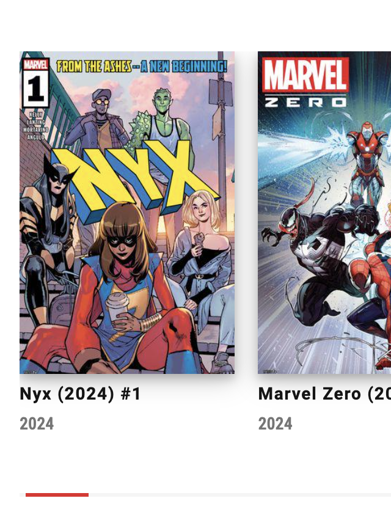
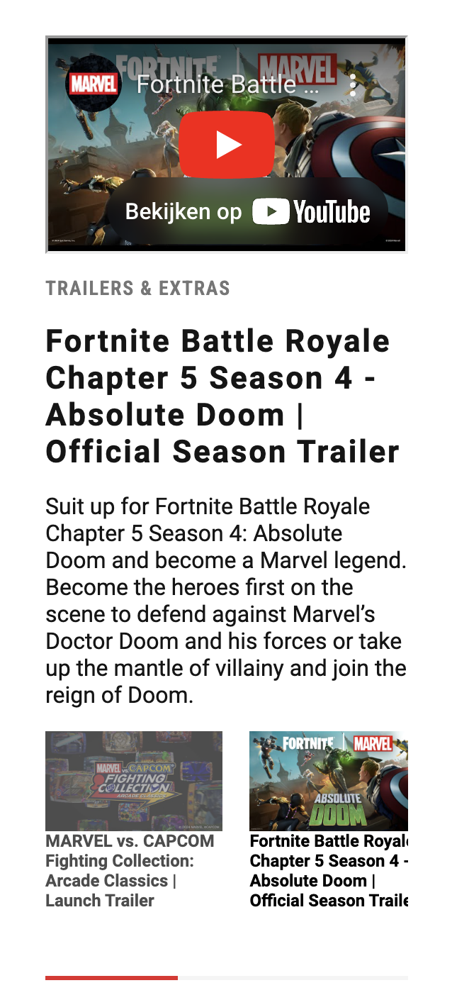
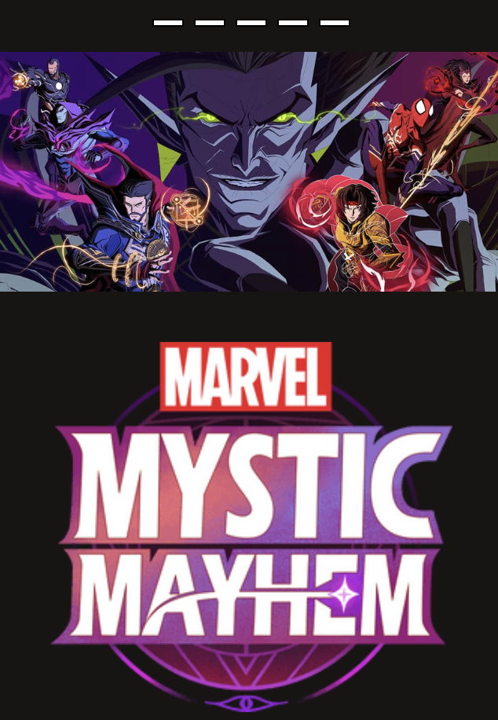
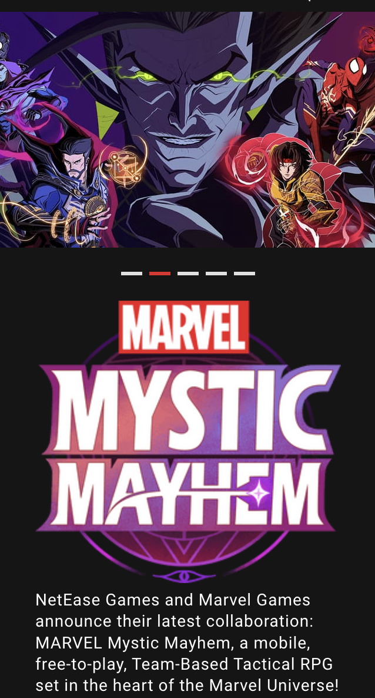
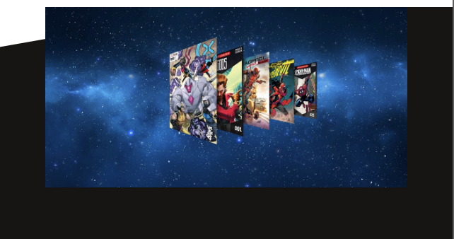

# Procesverslag
Markdown is een simpele manier om HTML te schrijven.  
Markdown cheat cheet: [Hulp bij het schrijven van Markdown](https://github.com/adam-p/markdown-here/wiki/Markdown-Cheatsheet).

Nb. De standaardstructuur en de spartaanse opmaak van de README.md zijn helemaal prima. Het gaat om de inhoud van je procesverslag. Besteedt de tijd voor pracht en praal aan je website.

Nb. Door *open* toe te voegen aan een *details* element kun je deze standaard open zetten. Fijn om dat steeds voor de relevante stuk(ken) te doen.

## Jij

  
uitwerken voor kick-off werkgroep

  ### Auteur:
  Sem van Wijk

  #### Je startniveau:
  Rood

  #### Je focus:
  Surface plane
 

## Je website

  
uitwerken voor kick-off werkgroep

  ### Je opdracht:
  link naar de website die je gaat namaken óf de naam/omschrijving van je eigen ontwerp
  Marvel home: https://www.marvel.com/
  Marvel Characters: https://www.marvel.com/characters

  #### Screenshot(s) van de eerste pagina (small screen): 
  Home 
  

  #### Screenshot(s) van de tweede pagina (small screen):
  Characters 
  
 

## Toegankelijkheidstest 1/2 (week 1)

  
uitwerken na test in 2e werkgroep

  ### Bevindingen
  Lijst met je bevindingen die in de test naar voren kwamen:
  - afbeeldingen zijn gelinked als een link terwijl er al een link voor dat onderdeel is, waardoor er dubbele links zijn
  - De datums van wanneer bepaalde artikelen zijn geplaatst worden opgelezen
  - Meerder keren word er naar "Marvel Insider" gelinked met alleen de tekst "join now" of "login" zonder dat de gebruiker weet wat het is
  - screenreader heeft moeite om door de draaiende carousel heen te komen
  - Op de chacters pagina leest de screenreader de superheldennaam van het personage, en daarna de naam van de persoon zonder pauze te nemen, waardoor het klinkt alsof iedereen een heel lange naam heeft.
  - Filter opties worden niet uitgelegd, alleen dat er een filter is

## Breakdownschets (week 1)

  
uitwerken na afloop 3e werkgroep

  ### hele pagina Home: 
  

  ### hele pagina Characters): 
  

## Voortgang 1 (week 2)

  
uitwerken voor 1e voortgang

  ### Stand van zaken
  hier dit ging goed & dit was lastig (neem ook screenshots op van delen van je website en code)

  ### Agenda voor meeting
  samen met je groepje opstellen

  | Sem     | Sam        | Bronger   | Nina        |
  | ---            | ---                | ---          | ---              |
  | Coorecte hemtl structuur  | Hoe ver moet ik zijn?             | css prooblemen    | css problemen    |
  |  |  |  |  |
  |             |             |          |            |

  ### Verslag van meeting
  hier na afloop snel de uitkomsten van de meeting vastleggen

  - Paar kleine foutjes in de html structuur, verder alles in orde
  - 
  - 
  - 

## Voortgang 2 (week 3)

  
uitwerken voor 2e voortgang

  ### Stand van zaken
  hier dit ging goed & dit was lastig (neem ook screenshots op van delen van je website en code)

  ### Agenda voor meeting
  samen met je groepje opstellen

  | Sem      | Sam        | Bronger   | Nina        |
  | ---            | ---                | ---          | ---              |
  | Hoe voeg je ruimte toe tussen de scrollbar en het de content   | geen vragen           |    |    |
  |  |  |  |  |
  |            |                |          |              |

  ### Verslag van meeting
  hier na afloop snel de uitkomsten van de meeting vastleggen

  - Moet meer css schrijven, maar verder is het prima
  - Met padding kan ik die ruimte toevoegen. Dit is een situatie waar padding oke is om te gebruiken.
  - 
- 

## Toegankelijkheidstest 2/2 (week 4)

  
uitwerken na test in 9e werkgroep

  ### Bevindingen
  Lijst met je bevindingen die in de test naar voren kwamen (geef ook aan wat er verbeterd is):

## Voortgang 3 (week 4)

  
uitwerken voor 3e voortgang

  ### Stand van zaken
  hier dit ging goed & dit was lastig (neem ook screenshots op van delen van je website en code)

  ### Agenda voor meeting
  samen met je groepje opstellen

  | Sem     | Sam          | Bronger    | Nina       |
  | ---            | ---                | ---          | ---              |
  | Hoe haal ik de radiobuttons weg en waarom doet foto het niet?  |             |     |     |
  | Hoe maak ik goude lijnen rondom tekst? |  |  |  |
  | Is logo animatie nodig bij het sticky menu?            |                 |           |               |

  ### Verslag van meeting
  hier na afloop snel de uitkomsten van de meeting vastleggen

  - Radio buttons weg met een label
  - Goude lijnen zijn een before en een after
  - Logo animatie is niet nodig
  - ...

## Eindgesprek (week 5)

  
uitwerken voor eindgesprek

  ### Je uitkomst - karakteristiek screenshots:
  

  ### Dit ging goed/Heb ik geleerd: 
  Korte omschrijving met plaatjes

  Ik heb geleerd om te werken met carousellen, checkboxes en op-pagina navigatie:
  
  
  

  ### Dit was lastig/Is niet gelukt:
  Korte omschrijving met plaatjes

  Het is me niet gelukt om de op-pagina naviagtie op de plek te zetten waar ik die wilde en om de huidige sectie een kleur te geven: 
  
  
  
  Ook had ik moeite met deze specifieke afbeelding en de sectie die gedraait is aan de bovenkant:
  

## Bronnenlijst

  
continu bijhouden terwijl je werkt

  Nb. Wees specifiek ('css-tricks' als bron is bijv. niet specifiek genoeg). 
  Nb. ChatGpT en andere AI horen er ook bij.
  Nb. Vermeld de bronnen ook in je code.

  1. https://www.w3schools.com/css/css3_shadows_box.asp
  2. https://chatgpt.com/share/672a2c8c-a6d0-8003-97bd-cf750a9b327f
  3. ...

